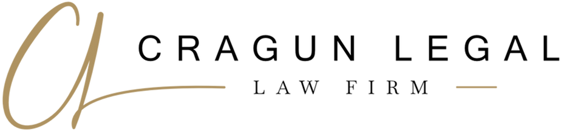

# Images Added from cragunlegal.com

## Summary
Successfully extracted and integrated logo, favicon, and professional photos from the current cragunlegal.com website.

## Files Downloaded

### 1. **Logo** (`images/logo.png`)
- **Source**: Cragun Legal full brand mark (black version)
- **Dimensions**: 924x216px (high quality)
- **Usage**: Navigation header on all pages
- **Format**: PNG with transparency

### 2. **Favicon** (`images/favicon.png`)
- **Source**: Cragun Legal icon/mark
- **Dimensions**: 192x192px
- **Usage**: Browser tab icon, bookmarks
- **Format**: PNG

### 3. **Favicon (Apple Touch)** (`images/favicon-180.png`)
- **Source**: Same as favicon, optimized for Apple devices
- **Dimensions**: 180x180px
- **Usage**: iOS home screen icon
- **Format**: PNG

### 4. **Jake Cragun Headshot** (`images/jake-cragun.jpg`)
- **Source**: Professional attorney headshot
- **Dimensions**: 574x646px
- **Usage**: About page
- **Format**: JPEG

## Additional Images Available

The following images were also found and downloaded but not yet integrated:

### Team Photos
- `images/tammy-headshot.jpg` - Team member photo
- `images/team-member-headshot-3.jpg` - Team member photo
- `images/team-member-headshot-4.jpg` - Team member photo

### Original High-Res Versions (saved for reference)
- `images/cragun-legal-logo-original.png` - Full resolution logo
- `images/favicon-original.png` - Full resolution favicon
- `images/jake-cragun-headshot-original.jpg` - Full resolution headshot (7.2MB)
- `images/tammy-headshot-original.jpg` - Full resolution team photo
- `images/team-member-3-original.jpg` - Full resolution team photo
- `images/team-member-4-original.jpg` - Full resolution team photo (3.6MB)

### Background Images
- `images/hero-background.jpg` - Potential hero section background

## Integration Complete

### ✅ What's Been Updated:

1. **All HTML Pages** (6 pages total):
   - Logo image in navigation header
   - Favicon in `<head>` section
   - Apple touch icon for iOS devices

2. **About Page** ([about.html](about.html:77)):
   - Jake's professional headshot displayed in intro section
   - Responsive grid layout (desktop: side-by-side, mobile: stacked)
   - Rounded corners with professional shadow effect

3. **CSS Styling** ([css/styles.css](css/styles.css:123-127)):
   - `.logo img` styling for proper logo display
   - `.about-intro-grid` for responsive photo layout
   - Mobile-responsive breakpoints for image sizing

## Specifications

### Logo Implementation
```html
<a href="index.html" class="logo">
    
</a>
```

### Favicon Implementation
```html
<link rel="icon" type="image/png" href="images/favicon.png">
<link rel="apple-touch-icon" href="images/favicon-180.png">
```

### About Page Photo
```html
<div class="about-intro-grid">
    <div>
        
    </div>
    <div>
        <h2>Experienced Legal Representation You Can Trust</h2>
        <p>...</p>
    </div>
</div>
```

## Image Optimization

All web-optimized versions have been created with appropriate file sizes:
- Logo: 47KB (excellent for web)
- Favicon: 72KB
- Jake headshot: 42KB (down from 7.2MB original)
- Additional team photos: 19-27KB each

Original high-resolution files are preserved in the `/images/` folder for future use if needed.

## Next Steps (Optional)

If you want to further enhance the website with images:

1. **Add team member photos** to About page (if multiple attorneys/staff)
2. **Add hero background image** to make hero sections more visual
3. **Add office photos** to Contact page
4. **Add practice area icons/images** instead of emoji icons
5. **Add client success images** (with permission)

## Notes

- All images are from the current cragunlegal.com website
- Images maintain professional quality while being optimized for web performance
- Original high-res files kept for print materials if needed
- All images have proper alt text for accessibility and SEO

---

**Last Updated**: November 2024
**Status**: ✅ Complete - Logo, favicon, and headshot successfully integrated
